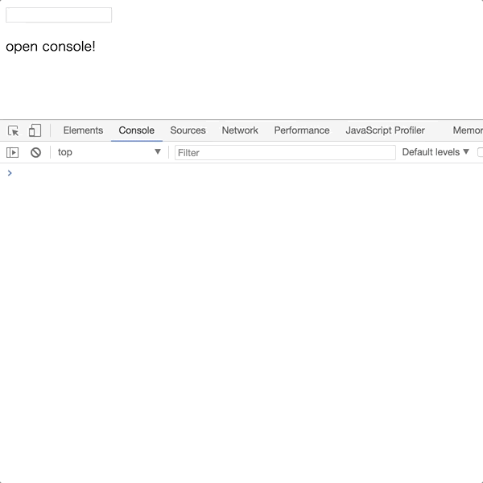

React Log Decorator
=====================

A decorator to log props and state with Decorators



Installation
------------

```sh
npm install react-log-decorator
```

Usage
-----

```jsx
import {Component} from 'react';
import logger from 'react-log-decorator';
const log = logger(process.env.NODE_ENV === 'development');

export default class MyComponent extends Component {
  @log
  render() {
    return (
      <div>
        <input type="text" onChange = {this.props.onChange} />
        <p>{this.props.message}</p>
      </div>
    )
  }
}
```

Please use default import

```js
import logger from 'react-log-decorator';
```

Please decide which you log props and state.
If you want to log them, set true.
If you want not to log them, set false.

```js
const log = logger(true);
```

This is then used on lifecycle methods as follows:

```js
@log
shouldComponentUpdate(nextProps, nextState) {
  return this.props.message !== nextProps.message;
}

@log
render() {
  return <p>{this.props.message}</p>
}
```

Then, run your React App and open browser's console.

### lifecycle methods you can use this decorator on

|methods|display|
|----|----|
|componentWillMount|props, state|
|componentDidMount|props, state|
|componentWillReceiveProps|props, state|
|componentWillReceiveProps|props, state, nextProps|
|shouldComponentUpdate|props, state, nextProps, nextState|
|componentWillUpdate|props, state, nextProps, nextState|
|componentDidUpdate|props, state, prevProps, prevState|
|componentWillUnmount|props, state|


### with [Babel](babel-plugin-transform-decorators-legacy)
Please use [babel-plugin-transform-decorators-legacy](https://www.npmjs.com/package/babel-plugin-transform-decorators-legacy)

Todo
---
* options to change style
